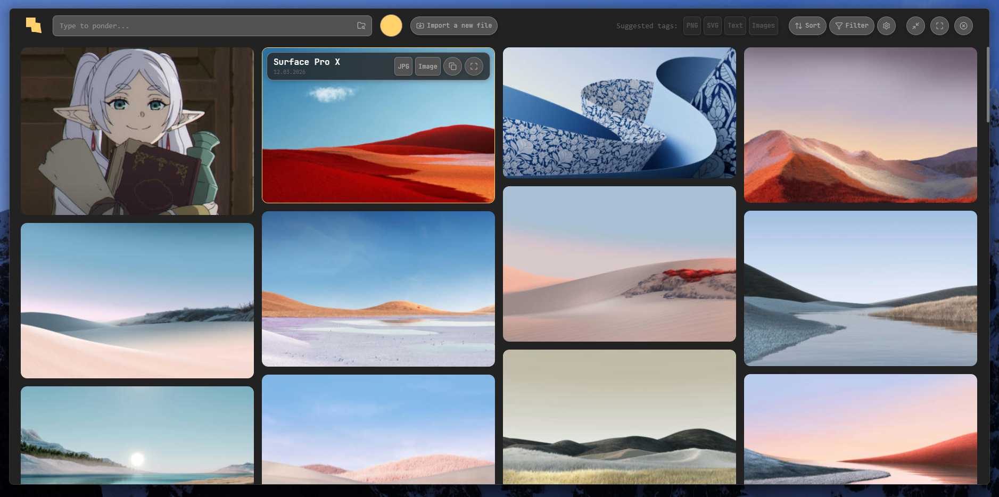

 

<h3 align = "left"> Splatera </h3> 

 Локальный менеджер ассетов и компонентов на основе визуальной сетки (Masonry), который структурирует файлы по их собственному типу. Нацелено на большие локальные базы референсов/шаблонов, к которым порой надо часто возвращаться. 
 

## Что это такое

- **Фронт - Masonry-сетка**, набор карточек для каждого файла. 
- **Импорт объектов через Drag & Drop**, без дублирования файлов.
- **Сортировка и фильтрация через теги**, некоторые из которых устанавливаются автоматически без ввода пользователя.
	- Плюс, фильтрация картинок по доминантному цвету
- Предпросмотр и быстрый перенос карточек в буфер обмена

### Misc

[Документацию по проекту](https://github.com/koksler/Splatera/tree/master/docs) можно прочитать прям тут, в репозитории. Написана в рамках студенческой разработки, поэтому суховата. 

| Платформа         | Ядро  | Frontend             | Backend | DB           |
| ----------------- | ----- | -------------------- | ------- | ------------ |
| Desktop (Windows) | Tauri | React + Tailwind CSS | Rust    | LowDB (JSON) |
