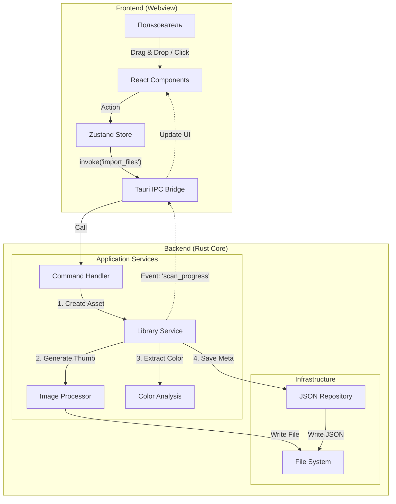

> Диаграмма показывает поток данных от действия пользователя до сохранения на диск.

### Пояснение связей:

1. **Frontend -> Backend:**
    - Пользователь перетаскивает файлы.
    - React вызывает команду `import_files`.

2. **Backend Processing:**
    - `Library Service` получает пути к файлам.
    - Делегирует `Image Processor` создание уменьшенной копии.
    - Делегирует `Color Analysis` получение палитры.

3. **Persistence:**
    - Результаты собираются в структуру `Asset`.
    - `Repository` сохраняет обновленный список в `db.json`.

4. **Feedback:**
    - Так как операция долгая, Backend шлет события (Events) прогресса обратно на Frontend, чтобы обновить UI (Progress Bar).