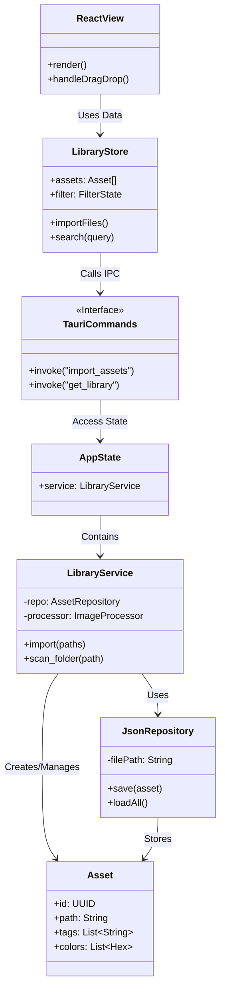

> Тут описана структура классов (для TS) и структур (для Rust), которые реализуют архитектуру приложения.

## Backend: Структуры Rust (Core Logic)

### Точка входа и Состояние (App State)

Это разделяемый ресурс, доступный во всех командах Tauri (Thread-safe).

```rust
struct AppState {
    // Мьютекс для безопасного доступа к сервису из разных потоков
    library_service: Mutex<LibraryService>,
    config: AppConfig,
}
```

### Сервисный слой (Service Layer)

Фасад для всей бизнес-логики. Он координирует работу репозитория и процессора изображений.

```rust
struct LibraryService {
    // Зависимости внедряются через трейты (для тестируемости)
    repository: Box<dyn AssetRepository>, 
    image_processor: Box<dyn ImageProcessor>,
    file_system: Box<dyn FileSystemOps>,
}

impl LibraryService {
    fn new(repo: JsonRepository, img: ImageSharpProcessor) -> Self { ... }
    
    // Use Cases
    fn import_files(&self, paths: Vec<String>) -> Result<Vec<Asset>> { ... }
    fn get_assets(&self, filter: FilterCriteria) -> Vec<Asset> { ... }
    fn scan_directory(&self, path: &str) -> Result<ScanReport> { ... }
}
```

### Инфраструктура (Infrastructure Implementation)

> Реализация интерфейсов, описанных в этапе [06_interfaces](https://github.com/koksler/Splatera/blob/master/docs/06_interfaces.md).

```rust
struct JsonRepository {
    db_path: PathBuf,
    cache: HashMap<String, Asset>, // In-memory кеш для быстрого поиска
}

struct ImageSharpProcessor {
    // Обертка над крейтом image-rs
    supported_formats: Vec<String>,
}
```

### Домен (Domain Entities)

Основные сущности данных (как описано в [этапе 4](https://github.com/koksler/Splatera/blob/master/docs/04_domain_dto_mapping.md)).

```rust
struct Asset {
    id: String,              // UUID v4
    original_path: String,   // Абсолютный путь к исходному файлу на диске
    preview_path: Option<String>, // Путь к сгенерированному превью (для картинок)
    kind: AssetKind,         // Тип контента
    dominant_colors: Vec<String>, // HEX-коды (напр. ["#FF0000", "#00FF00"])
    tags: Vec<String>,       // Список тегов (авто + ручные)
    metadata: FileMetadata,  // Технические данные
    width: u32,
    height: u32,
    created_at: u64,         // Unix timestamp добавления в базу
}

enum AssetKind {
    Image, // JPG, PNG, WEBP, GIF, SVG
    Code,  // JS, PY, RS, JSON, CSS...
    Text,  // TXT, MD
    Unknown
}

struct Palette {
    primary: String,   // HEX
    secondary: String,
    accents: Vec<String>,
}
```

## Frontend: Классы и Компоненты

На клиенте используется функциональный подход (React Hooks), но архитектурно выделяются следующие блоки.

### State Management (Store)

`useLibraryStore` (Zustand) выполняет роль ViewModel для всего приложения.

```typescript
class LibraryStore {
    // State
    assets: AssetViewDto[] = [];
    selectedAssetId: string | null = null;
    isScanning: boolean = false;
    
    // Actions (Methods)
    async importFiles(files: FileList): Promise<void> {
        this.isScanning = true;
        await invoke('import_command', { files });
        await this.refreshLibrary();
        this.isScanning = false;
    }

    setFilter(criteria: FilterCriteria): void {
        // Локальная фильтрация списка assets
    }
}
```

### UI Components (Views)

Иерархия компонентов интерфейса.
- `AppShell`: Корневой лейаут (TitleBar + ContentArea).
- `MasonryGrid`: Умная сетка.
    - *Props*: `items: Asset[]`, `columnCount: number`.
    - *Logic*: Вычисляет абсолютные позиции карточек (layout engine).
- `AssetCard`: Отображение одного элемента.
    - *Props*: `data: AssetViewDto`.
    - *Logic*: Обработка клика, Drag&Drop, Lazy Loading картинки.
- `FilterPanel`: Управление состоянием фильтра.
    - *Props*: `activeTags: string[]`, `onTagToggle: fn`.

## Диаграмма классов (Mermaid)

Визуализация связей между слоями (Frontend <-> Bridge <-> Backend).

