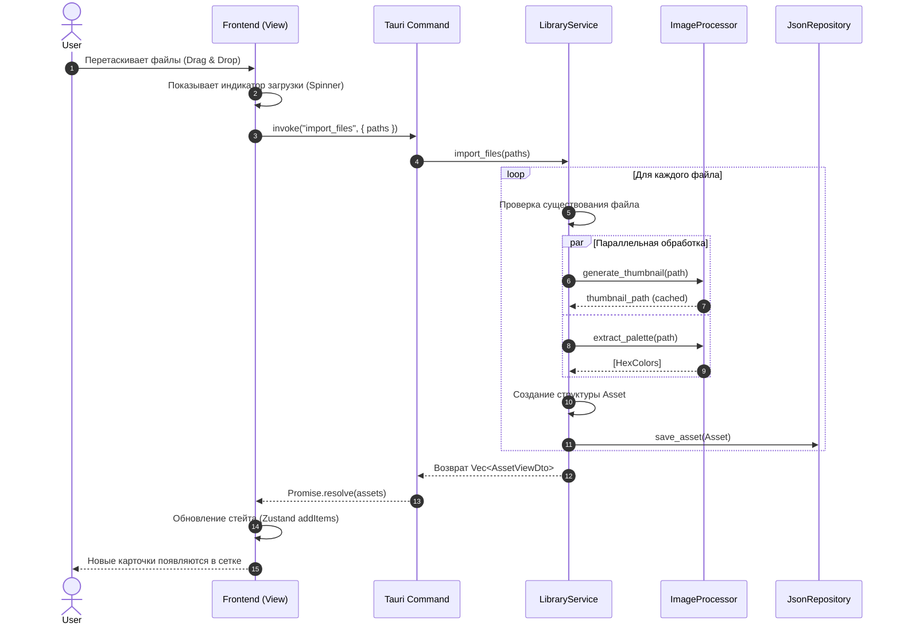
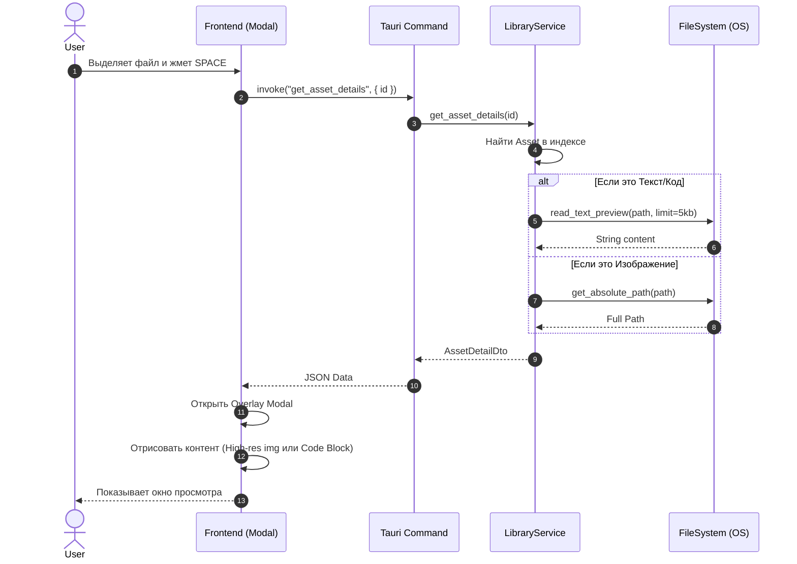
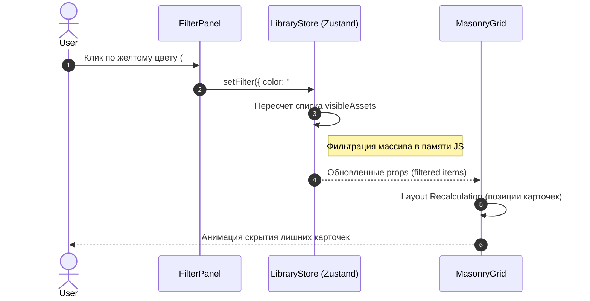

# Диаграммы последовательности (Sequence Diagrams)

Визуализация взаимодействия между Frontend (React), Bridge (Tauri) и Backend (Rust) во времени.

## 1. Сценарий: Импорт новых файлов (Drag & Drop)

Самый сложный процесс в приложении. Включает в себя обработку файлов, генерацию графики и сохранение в БД.

**Участники:**

- **User**: Пользователь.
- **UI (React)**: Компонент сетки и Dropzone.
- **Bridge**: IPC канал Tauri.
- **LibraryService**: Основная логика Rust.
- **ImageProcessor**: Модуль обработки графики.
- **Repository**: Слой данных (JSON DB).

## 2. Сценарий: Быстрый просмотр (Quick Look)

Сценарий чтения данных. Происходит, когда пользователь нажимает Space на выбранной карточке. Требует подгрузки полного пути или текстового содержимого, которого нет в облегченной версии для сетки.

**Участники:**

- **User**: Пользователь.
- **UI (React)**: Модальное окно.
- **Service**: Бэкенд логика.
- **FileSystem**: Доступ к диску ОС.

## 3. Сценарий: Фильтрация по цвету (Локальная)

Показывает взаимодействие внутри Frontend, так как библиотека загружена в память (State).

